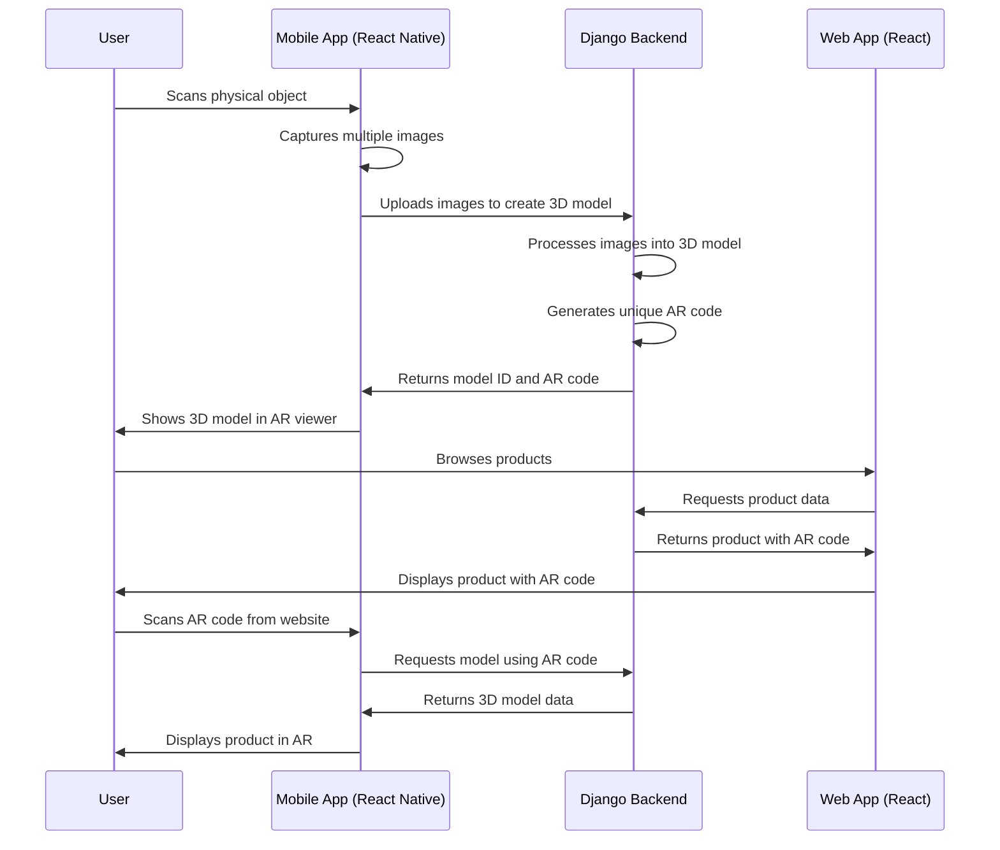
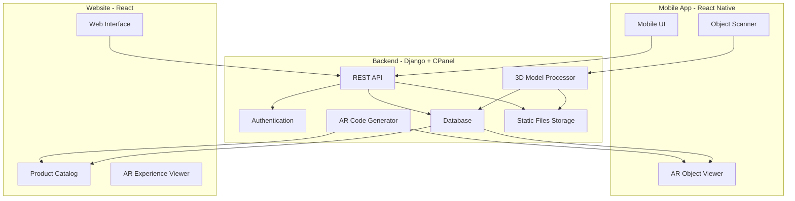

# AR E-commerce

This project aims to create a comprehensive AR solution for e-commerce that allows:
1. Scanning physical objects to create 3D models
2. Generating AR codes for these models
3. Viewing the 3D objects through a camera using AR technology

## Technical Components Breakdown

### Mobile App (React Native)
- **Object Scanning Module**
  - Use React Native's camera access combined with AR libraries
  - Implement photogrammetry techniques to generate 3D models from multiple photos
  - Consider using libraries like ViroReact or React Native AR Kit

- **AR Viewer Module**
  - Implement AR code scanner
  - Render 3D models in augmented reality
  - Allow rotation, scaling, and placement of objects in real environment

### Website (React)
- **Product Display**
  - Show catalog of available 3D models
  - Display product information and AR preview capabilities
  - Generate and display AR codes for each product

- **Admin Interface**
  - Manage 3D models and product information
  - Generate and download AR codes
  - View analytics on model usage

### Backend (Django)
- **API Endpoints**
  - User authentication and authorization
  - 3D model upload, storage, and retrieval
  - AR code generation and management
  - Product information CRUD operations

- **Storage System**
  - Database for product metadata and user information
  - File storage for 3D models and AR resources
  - Optimization system for 3D models

## Implementation Plan

# Implementation Plan

## Phase 1: Foundation Setup
- Set up Django project with cPanel compatibility
- Create React web application scaffold
- Initialize React Native mobile application
- Design database schema
- Implement user authentication system

## Phase 2: Core Functionality
- Build Django API endpoints for model storage and retrieval
- Implement 3D model upload and processing in Django
- Develop AR code generation system
- Create basic web interface for product management
- Implement mobile camera access and basic AR viewing

## Phase 3: AR & 3D Model Integration
- Integrate 3D scanning capabilities into the mobile app
- Implement AR model viewing in React Native
- Connect AR code scanning with 3D model retrieval
- Build web-based 3D preview component
- Set up system for model optimization

## Phase 4: E-commerce Integration
- Implement product catalog and search functionality
- Add shopping cart and checkout process
- Create user profiles and order history
- Implement analytics for product viewing
- Build reporting dashboard

## Phase 5: Refinement & Launch
- Optimize performance for large models
- Implement caching strategies
- Conduct cross-device testing
- Security auditing and penetration testing
- Prepare deployment pipelines

## Key Technical Considerations

1. **3D Model Processing**
   - Use WebGL for web-based 3D rendering
   - Consider Three.js for web visualization
   - Optimize models for mobile viewing (reduce polygon count)

2. **AR Code System**
   - Use QR codes with embedded model IDs or URLs
   - Alternative: custom AR markers for better visual integration

3. **Performance Optimization**
   - Progressive loading of 3D models
   - Server-side model optimization
   - Caching strategies for frequently accessed models

4. **cPanel Compatibility**
   - Ensure Django deployment works with cPanel
   - Configure static file serving via cPanel
   - Set up proper WSGI configuration

5. **Data Storage**
   - Store 3D models in optimized formats (glTF, GLB)
   - Implement versioning for model updates
   - Consider CDN integration for faster model delivery

## WorkFlow Diagram / System Architecture

## FlowChart

# Deployment Instructions for AR E-commerce on CPanel

This guide will help you deploy the AR E-commerce application on a CPanel hosting environment. The application consists of three main components:

1. React Native Mobile App
2. React Web Application
3. Django Backend

## Django Backend Deployment

### 1. Prerequisites

Ensure your CPanel hosting supports:
- Python 3.8+ 
- Passenger WSGI
- MySQL or MariaDB
- Django 4.2+

### 2. Setting Up CPanel Environment

1. **Create a Python Application in CPanel:**
   - Go to the CPanel dashboard
   - Find the "Setup Python App" section
   - Create a new Python application with your domain
   - Select Python 3.8 or higher
   - Set the application path to `/ar_ecommerce`
   - Set the application entry point to `/ar_ecommerce/passenger_wsgi.py`

2. **Create a Database:**
   - Go to MySQL Databases in CPanel
   - Create a new database and user
   - Grant all privileges to the user
   - Update the database settings in `settings.py` with your credentials

### 3. Uploading Files

1. **Prepare Your Project:**
   - On your local machine, run `pip freeze > requirements.txt` to generate requirements
   - Create a zip archive of your Django project

2. **Upload and Extract:**
   - Use CPanel File Manager to upload your zip file
   - Extract to the Python application directory you created
   - Make sure `passenger_wsgi.py` is at the correct location

3. **Install Requirements:**
   - Use CPanel's Python application interface to install requirements:
   ```
   pip install -r requirements.txt
   ```

### 4. Configure Static and Media Files

1. **Create required directories:**
   ```bash
   mkdir -p media/models media/images static
   ```

2. **Set proper permissions:**
   ```bash
   chmod -R 755 media static
   ```

3. **Collect static files:**
   ```bash
   python manage.py collectstatic --noinput
   ```

### 5. Database Setup

1. **Run migrations:**
   ```bash
   python manage.py migrate
   ```

2. **Create a superuser:**
   ```bash
   python manage.py createsuperuser
   ```

### 6. Additional CPanel Configuration

1. **Create `.htaccess` file:**
   - Copy the .htaccess content from the provided code
   - Save it in your web root directory

2. **Enable HTTPS:**
   - Set up SSL certificates through CPanel
   - Force HTTPS redirect

3. **Configure domain pointing:**
   - Point your domain to the Python application

## React Web Application Deployment

### 1. Building the React App

1. **Install dependencies:**
   ```bash
   npm install
   ```

2. **Update API endpoint:**
   - Edit `BACKEND_URL` in your code to point to your CPanel domain
   - Ensure CORS is properly configured on both ends

3. **Build the app:**
   ```bash
   npm run build
   ```

### 2. Uploading to CPanel

1. **Create a subdomain or directory:**
   - Create a subdomain like `shop.yourdomain.com` or use a directory like `yourdomain.com/shop`

2. **Upload build files:**
   - Upload the contents of the build directory to the subdomain or directory
   - Ensure `index.html` is at the root

3. **Create `.htaccess` for React routing:**
   ```apache
   <IfModule mod_rewrite.c>
     RewriteEngine On
     RewriteBase /
     RewriteRule ^index\.html$ - [L]
     RewriteCond %{REQUEST_FILENAME} !-f
     RewriteCond %{REQUEST_FILENAME} !-d
     RewriteRule . /index.html [L]
   </IfModule>
   ```

## React Native Mobile App Deployment

### 1. Configure API Endpoints

1. **Update the `BACKEND_URL` constant:**
   - Change to your production API domain with HTTPS
   - Ensure API endpoints are accessible from external networks

### 2. Building for iOS and Android

1. **iOS Build:**
   ```bash
   expo build:ios
   ```

2. **Android Build:**
   ```bash
   expo build:android
   ```

3. **Submit to App Stores:**
   - Follow the App Store and Google Play submission guidelines
   - Provide necessary metadata, screenshots, and descriptions

## Testing Your Deployment

1. **Test the Django Admin:**
   - Visit `https://yourdomain.com/admin`
   - Login with your superuser credentials
   - Verify you can create products and upload images

2. **Test the Web Application:**
   - Visit your web application URL
   - Browse products and check AR functionality

3. **Test the Mobile App:**
   - Install the app on a test device
   - Verify scanning and AR viewing capabilities

## Troubleshooting

### Common Issues:

1. **500 Internal Server Error:**
   - Check the CPanel error logs
   - Verify `passenger_wsgi.py` is correctly configured
   - Check file permissions (755 for directories, 644 for files)

2. **CORS Issues:**
   - Verify CORS headers are properly set in Django
   - Check the `.htaccess` file for correct CORS configuration

3. **Static/Media Files Not Loading:**
   - Check file paths in settings.py
   - Verify directory permissions
   - Ensure web server is configured to serve these directories

4. **Database Connection Issues:**
   - Verify database credentials in settings.py
   - Check database user permissions

### Support Resources:

- Django Documentation: https://docs.djangoproject.com/
- React Documentation: https://reactjs.org/docs/
- React Native Documentation: https://reactnative.dev/docs/
- CPanel Documentation: https://docs.cpanel.net/
